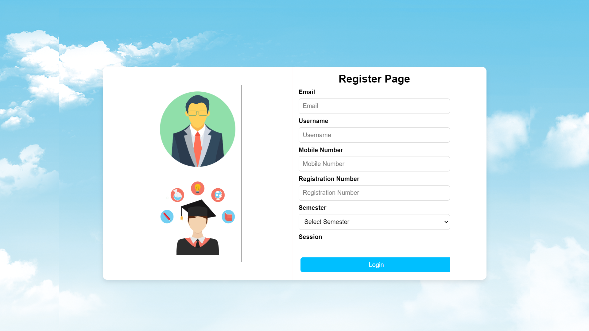
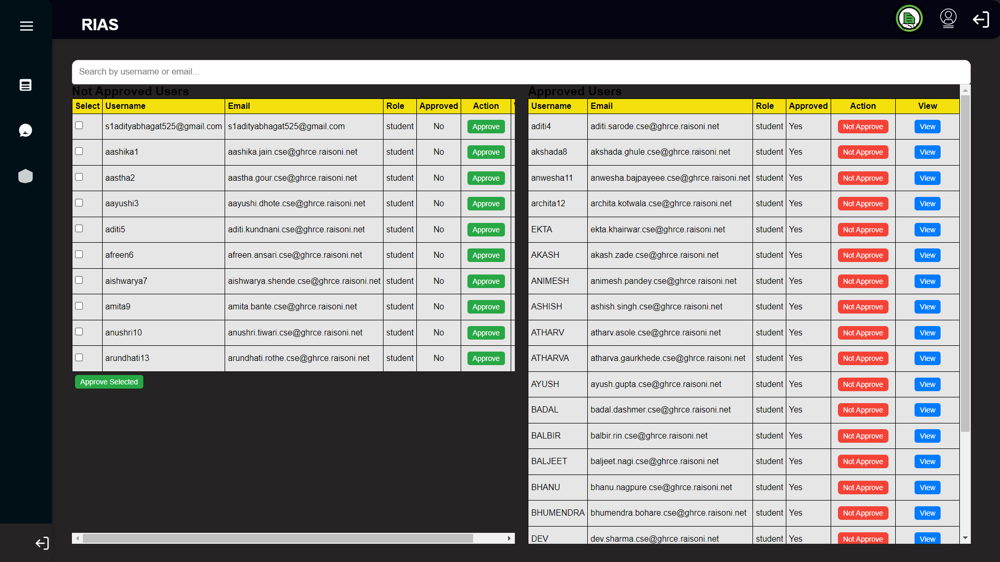

# Response Insight Analysis System (RIAS)

### Revolutionizing Faculty-Student Interaction & Educational Feedback

---

## Table of Contents
1. [Introduction](#introduction)
2. [Features](#features)
   - [For Students](#for-students)
   - [For Faculty](#for-faculty)
   - [For Admin](#for-admin)
3. [Technology Stack](#technology-stack)
4. [System Architecture](#system-architecture)
5. [Installation](#installation)
   - [Backend Setup](#backend-setup)
   - [Frontend Setup](#frontend-setup)
6. [Usage](#usage)
7. [API Documentation](#api-documentation)
8. [Screenshots](#screenshots)
9. [Future Enhancements](#future-enhancements)
10. [Contributing](#contributing)
11. [Contact](#contact)

---

## Introduction

The **Response Insight Analysis System (RIAS)** is an advanced platform designed to enhance faculty-student interactions through data-driven feedback mechanisms. It empowers students to provide detailed feedback on lectures, instructors, and the overall educational environment while offering administrators and faculty members actionable insights into teaching performance, student engagement, and academic improvement strategies.

The platform includes secure, role-based dashboards for students, faculty, and administrators to manage and analyze feedback, generate reports, and track progress in a user-friendly interface.

## Features

### For Students
- **Role-Based Secure Login:** Students can securely log in and access their personalized dashboard.
- **Feedback Submission:** Students submit daily feedback on classes, teachers, and teaching methods. Absent students are restricted from submitting feedback.
- **Timetable Integration:** Students can view their pre-loaded class schedules, including faculty and subject details.
- **Reward System:** Points are awarded for daily feedback submissions. These points can be redeemed for academic credits.
- **Monthly Surveys:** Participate in surveys about changes in teaching methods and campus environment. 


### For Faculty

- **Feedback Review:** Faculty members can review detailed feedback submitted by students, with options to filter the feedback based on time periods such as daily, weekly, or monthly. This feature allows faculty to gain insights into student perceptions and experiences over various timescales.

- **Performance Reports:** Faculty can generate and export performance reports, which provide detailed analyses of their teaching effectiveness and areas needing improvement. These reports help faculty members to understand their performance and identify opportunities for professional development.

- **Comparative Analysis:** Faculty members can compare their individual feedback scores with class averages. This comparative analysis helps faculty to understand their performance relative to other instructors and to adjust their teaching methods accordingly.

- **Faculty Mapping Subject and Faculty to Students:** Faculty can manually map subjects and faculty assignments to students, ensuring accurate tracking of who is teaching which classes. This mapping can also be done in bulk via CSV file uploads, streamlining the process of updating student records.

- **Faculty Update and Edit Mapping:** Faculty can update and edit the mapping of subjects and assignments as needed. This feature provides flexibility to make adjustments to the mapping in response to changes in class schedules or teaching assignments.

- **Faculty Approve Students Based on Various Criteria:** Faculty have the capability to approve student-related activities based on specific criteria. This may include verifying student participation or performance metrics as part of the feedback or grading process.


### For Admin

- **Administrative Dashboard:** Admins can access and manage all student and faculty feedback through a comprehensive dashboard, which includes various metrics and navigation tools. This interface allows admins to efficiently oversee and respond to feedback submissions and performance data.

- **Anti-Ragging System:** A dedicated feature for reporting and managing anti-ragging issues is available. This system allows students to report incidents directly, enabling admins to address and resolve these concerns effectively.

- **Data Analytics:** Admins receive AI-powered insights and predictive analysis reports that help in evaluating faculty performance and tracking student engagement trends. This includes various types of analyses:
  - **Department or Branch Analysis:** Analyze feedback and performance metrics across different departments or branches.
  - **Same Subject Analysis:** Compare feedback for the same subject taught by different faculty members.
  - **Same Faculty, Different Subjects Feedback Analysis:** Review feedback from the same faculty member across different subjects to assess teaching effectiveness.
  - **Feedback Statistics:** Track overall feedback metrics, such as submission rates and satisfaction scores.

- **Detailed Reporting:** Admins can generate and export detailed reports that include charts and tables on faculty performance, student feedback, and overall trends. This functionality supports in-depth analysis and presentation of feedback data.

- **Register Users By CSV File & RIAS Sidebar:** Admins can bulk register users through CSV file uploads and manage various administrative functions via the RIAS sidebar, which streamlines access to key tools and features.


---

## Technology Stack

**Frontend:**
- React.js (for component-based UI development)
- HTML5/CSS3, Bootstrap (for responsive design)
- Chart.js and D3.js (for data visualization)

**Backend:**
- Node.js (runtime environment)
- Express.js (for API routing)
- JWT (for secure authentication)
- MongoDB (NoSQL database for storing feedback, user data, etc.)

**Data Science & Analytics:**
- Python (for machine learning, data processing)
- scikit-learn, pandas, NumPy (for predictive analytics)

**Version Control:**
- Git and GitHub (for version control and collaboration)

---

## System Architecture

The **RIAS** system is built using the **MERN stack (MongoDB, Express.js, React.js, Node.js)**. The system utilizes role-based access control (RBAC) for managing permissions between student, faculty, and admin roles. Below is an overview of the architecture:

1. **Frontend**: Built with React.js, offering a responsive and dynamic user interface for students, faculty, and admins.
2. **Backend**: Node.js + Express.js handles API requests, authentication, and business logic.
3. **Database**: MongoDB stores user data, feedback submissions, schedules, and reports.
4. **Machine Learning**: Python-based predictive models analyze feedback data for trends, insights, and reports.


---

## Installation

Follow these steps to set up the project locally.

### Prerequisites
- **Node.js**: Install from [Node.js official site](https://nodejs.org).
- **MongoDB**: Install from [MongoDB official site](https://www.mongodb.com).
- **Python**: Required for running machine learning scripts.

### Backend Setup

1. Clone the backend repository:
    ```bash
    git clone https://github.com/Aditya-Bhagat03/RIAS.git
    ```
2. Navigate to the backend directory:
    ```bash
    cd rias-backend
    ```
3. Install required dependencies:
    ```bash
    npm install
    ```
4. Set up environment variables in a `.env` file (example below):
    ```plaintext
    MONGO_URI=mongodb://localhost:27017/rias-db
    JWT_SECRET=your-jwt-secret
    PORT=5000
    ```
5. Start the backend server:
    ```bash
    npm run dev
    ```

### Frontend Setup

1. Clone the frontend repository:
    ```bash
    git clone https://github.com/Aditya-Bhagat03/RIAS.git
    ```
2. Navigate to the frontend directory:
    ```bash
    cd rias-frontend
    ```
3. Install dependencies:
    ```bash
    npm install
    ```
4. Start the React app:
    ```bash
    npm start
    ```

http://localhost:3000


- **Students** can log in and submit feedback.
- **Faculty** can log in and review feedback reports.
- **Admins** can manage user roles, view detailed insights, and access the anti-ragging feature.

---

## API Documentation

Here is a brief overview of the API endpoints:

- **Authentication**
    - `POST /api/auth/register`: Register a new user (admin, student, faculty).
    - `POST /api/auth/login`: Log in and obtain a JWT token.

- **Feedback**
    - `GET /api/feedback/student/:id`: Fetch feedback for a specific student.
    - `POST /api/feedback`: Submit feedback for a session.

- **Admin**
    - `GET /api/admin/reports`: Get detailed performance and feedback reports.

For full API documentation, visit [API Docs](https://drive.google.com/file/d/1x-m1HvuowvOxFJta-cMJLuUNEW3eMjrV/view?usp=sharing).

---
## Screenshots


### Login Page


### Register Page


### Student Dashboard & Profile Page


### Student Timetable Mapping page


### Student Feedback page


### Faculty Dashboard
### Faculty Mapping Subject and Faculty to student Manually


### Faculty Mapping Subject and Faculty to student By Csv File


### Faculty Update and Edit Mapping 


### Faculty Approve Student Based on Various Criteria



### Admin Dashboard
### Simple Admin Dashboard


### Department or Branch Analysis


### Same Subject Analysis


### Same Faculty, Different Subjects Feedback Analysis


### Feedback Statistics


### Register Users By CSV File & RIAS Sidebar


- **Google Drive PDF Folder & PDF Download:** Access and manage PDF documents related to reports and feedback statistics through the dedicated [Google Drive folder](https://drive.google.com/drive/folders/1i5KkLFrWxXgJtFgHf3T5Bc6lRP-ape9R?usp=sharing). This folder contains all PDFs generated by RIAS, with the capability to download them for offline review and record-keeping.


---

## Future Enhancements

- **Mobile App Development**: Extend support for iOS and Android platforms.
- **AI-Enhanced Feedback Analysis**: Leverage natural language processing (NLP) to derive insights from student comments.
- **Multilingual Support**: Add support for additional languages to cater to diverse student populations.
- **Gamified Learning Experience**: Implement a gamified rewards system to increase student engagement.

---

## Contributing

Contributions are what make the open-source community such an amazing place to learn, inspire, and create. Any contributions you make to **RIAS** are **greatly appreciated**!

1. Fork the repository.
2. Create a new feature branch (`git checkout -b feature/AmazingFeature`).
3. Commit your changes (`git commit -m 'Add AmazingFeature'`).
4. Push to the branch (`git push origin feature/AmazingFeature`).
5. Open a pull request.

---

## Contact

**Aditya Bhagat**  
- LinkedIn: [Aditya Bhagat](https://www.linkedin.com/in/aditya-bhagat03/)  
- Portfolio: [Aditya Bhagat](https://aditya-bhagat.netlify.app/)  
- Email: [adityabhagat525@gmail.com](adityabhagat525@gmail.com)

---


## Usage

Once both the backend and frontend are running, open your browser and navigate to: http://localhost:3000
